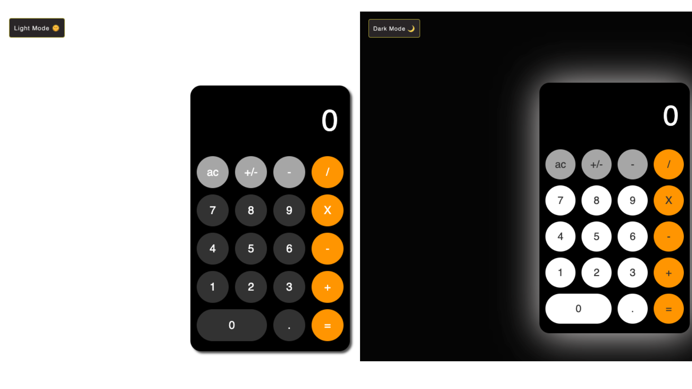

# Calculator_ios
A Calculator with changed 'dark theme'. Built using HTML, CSS and JavaScript. 

Feel free to check out the code and don't forget to star the repo.⭐

# See what's on display and try:
https://jsfiddle.net/burchikMax/xo3ad4k7/

# How to intall (Clone):
    1. Create folder in your local pc.
    2. Open this folder in your editor code.
    3. Open console, type "git clonehttps://github.com/burchik017/Calculator_ios.git" .

